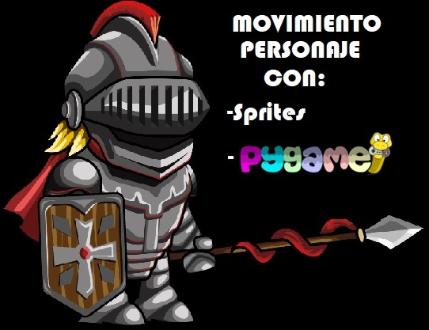
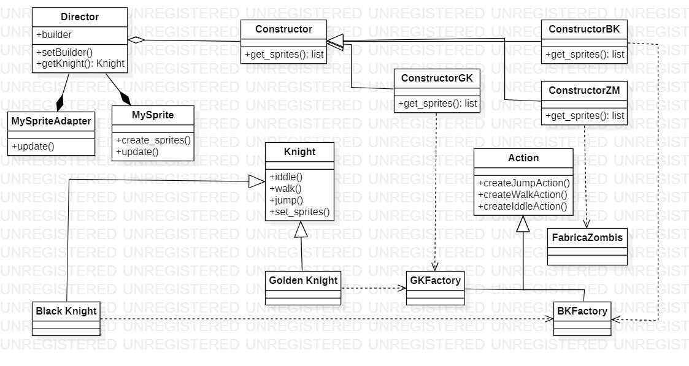

# Movimiento personajes



- [Movimiento personajes](#movimiento-personajes)
  - [**INTEGRANTES**](#integrantes)
  - [**DIAGRAMA UML**](#diagrama-uml)
  - [**¿CÓMO EJECUTAR?**](#cómo-ejecutar)
    - [**PASOS PARA INSTALAR PYTHON**](#pasos-para-instalar-python)
      - [**PARA WINDOWS O MacOS**](#para-windows-o-macos)
      - [**PARA LINUX/UNIX**](#para-linuxunix)
    - [**PASOS PARA INSTALAR PYGAME**](#pasos-para-instalar-pygame)
      - [**PARA WINDOWS**](#para-windows)
      - [**PARA UNIX**](#para-unix)
      - [**PARA MacOS**](#para-macos)
  - [**EXPLICACIÓN CÓDIGO**](#explicación-código)
    - [**BUILDER**](#builder)
      - [**KNIGHT**](#knight)
      - [**BLACK KNIGHT**](#black-knight)
      - [**GOLDEN KNIGHT**](#golden-knight)
      - [**DIRECTOR**](#director)
    - [**ABSTRACT FACTORY**](#abstract-factory)
      - [**ACTIONS**](#actions)
      - [**GAME**](#game)
      

      

## **INTEGRANTES**

- Andrés David Beltrán Rojas 20182020090

- Laura Tatiana Ramírez Rodríguez 20182020098

- Javier Santiago Borbón 20182020085

## **DIAGRAMA UML**



  
## **¿CÓMO EJECUTAR?**

Para que este código funcione se debe tener instalado en el sistema Python 3.7+, y el modulo Pygame, si usted dispone de esto, podrá disfutar de una linda serenata interpretada por nuestros músicos del programa, de lo contrario siga las siguientes indicaciones:

REQUISITOS MÍNIMOS DEL SISTEMA:

- Se debe contar con un dispositivo Windows (posterior a XP), Linux/UNIX o MacOS.

- Poseer al menos de 100 Mb de espacio disponible (25 Mb del instalador y 90 Mb para funcionar).

### **PASOS PARA INSTALAR PYTHON**

#### **PARA WINDOWS O MacOS**

1. Ir al área de descargas para [Windows](https://www.python.org/downloads/windows/) o para [MacOS](https://www.python.org/downloads/mac-osx/) del sitio oficial y descargar el instalador ejecutable Python 3.8 de 32 o 64 bit.

2. Iniciar la instalación ejecutando el archivo (con privilegios) descargado Python-3.8.3. Si es necesario, confirmar la ejecución en la ventana de advertencia de seguridad de Abrir archivo.

3. Una vez iniciado el instalador, en la ventana Install Python 3.8.3 (64 bit) activar las casillas de las opciones: Install launcher for all users (recommended) y Add Python 3.8 to PATH. Después, continuar seleccionando la opción Customize installation. Choose Location and features.

4. Seguir las indicaciones del instalador.

5. En la ventana Setup was successful, una vez que ha concluido el proceso de instalación hacer clic en el botón [Close]. Desde esta ventana es posible acceder a un tutorial online de Python, a la documentación oficial del lenguaje y a información con las novedades de la presente versión.

#### **PARA LINUX/UNIX**

1. Verifique si su distribución viene con python preinstalado, para saber esto utilice el comando:

¿Tiene python inferior a 3?

```
$ python --version
```

o
¿Tiene python 3?

```
$ python3 --version
```

1. Si su respuesta a ambas preguntas no fue satisfactorio o si no posee Python 3 versión 3.7+ o una versión posterior, siga los pasos a continuación dependiendo de la versión del SO que disponga, si no conoce que versión posee ejecute el siguiente comando:

```
$ cat /etc/*version
```

En derivados de Debian, como por ejemplo Ubuntu, use apt:

```
$ sudo apt-get install python3
```

En Red Hat y sus derivados, use yum:

```
$ sudo yum install python3
```

En SUSE y sus derivados, use zypper:

```
$ sudo zypper install python3
```

3. Abra la terminal y ejecute el siguiente comando para verificar que Python está instalado correctamente.

```
$ python3 --version
```

### **PASOS PARA INSTALAR PYGAME**

1. Para poder utilizar PYGAME debes de tener, al menos, Python 3.7 instalado.
2. Para instalar PYGAME vamos a utilizar pip. Así que simplemente deberemos de escribir en nuestra línea de comandos lo siguiente:

#### **PARA WINDOWS**

```
$ py -m pip install -U pygame --user
py -m pygame.examples.aliens
```

#### **PARA UNIX**

Siga los pasos de acuerdo a su distribución:

 - **Debian/Ubuntu/Mint**

```
sudo apt-get install python3-pygame
python3 -m pygame.examples.aliens
```

 - **Fedora/Red hat**

```
sudo yum install python3-pygame
python3 -m pygame.examples.aliens
```
 - **Arch/Manjaro**

```
sudo pamac install python-pygame
python -m pygame.examples.aliens
```
#### **PARA MacOS**

 - **MacOS X o Posterior**
```
python3 -m pip install -U pygame==2.0.0.dev6 --user
python3 -m pygame.examples.aliens
```
 - **Versiones anteriores a MacOS X**

```
python -m pip install pygame
python -m pygame.examples.aliens
```

## **EXPLICACIÓN CÓDIGO**

Este código se realizó utilizando los patrones de programación Abstract Factory y Build, estos se evidenciaran en fragmentos de este apartado.

### **BUILDER**

Para cumplir con el patrón Builder, es necesario aplicar diferentes clases en el código, estas son:

#### **KNIGHT**

Una clase abstracta, conocida como "Builder", en este programa le hemos bautizado Knight, y en esta se crean los métodos o acciones que llevará cada uno de los caballeros.

```python
class Knight():
    '''
    clase abstracta que define las acciones 
    '''

    def iddle(self):
        pass

    def walk(self):
        pass

    def jump(self):
        pass

```

Una clase que implemente el Builder, conocida como "Concrete Builder", esta tambien se encarga de construir las partes necesarias para construir los productos, en este código la hemos bautizado como Black Knight y Golden Knight, para el caballero negro y el dorado, respectivamente.

#### **BLACK KNIGHT**

```python
# Concret Builder
from Logic.Knight import *
from Logic.Actions import *


class BlackKnight(Knight):
    '''
    Concrete Factory Black Knight
    '''

    def iddle(self):
        super().iddle()
        i = BKFactory()
        return i.createIddleAction()

    def walk(self):
        super().walk()
        w = BKFactory()
        return w.createWalkAction()

    def jump(self):
        super().jump()
        j = BKFactory()
        return j.createJumpAction()

```

#### **GOLDEN KNIGHT**

```python
# Concret Builder
from Logic.Knight import *
from Logic.Actions import *


class GoldenKnight(Knight):

    '''
    Concrete Factory Golden Knight
    '''

    def iddle(self):
        super().iddle()
        i = GKFactory()
        return i.createIddleAction()

    def walk(self):
        super().walk()
        w = GKFactory()
        return w.createWalkAction()

    def jump(self):
        super().jump()
        j = GKFactory()
        return j.createJumpAction()


```
También se encuentra una clase Director, cuyo funcionamiento es el de construir un objeto utilizando el patron descrito en esta sección. Para esto hace uso de los diferentes constructores.

#### **DIRECTOR**

```python
# Class Director emplea la clase abstracta
from Logic.Knight import *
from Game import *


class Director:

    '''
    Implementa el constructor y retorna el producto
    '''
    __builder = None

    def setBuilder(self, builder):
        self.__builder = builder

    def getknight(self, num):
        sprite = self.__builder.get_sprites()
        knight = MySprite(sprite[num])
        return knight


class Constructor():
    def get_sprites(self): pass
```

```python

class ConstructorBK():
    '''
    Construir los personajes a partir de las fabrica BK
    '''

    def __init__(self):
        self.factory = BKFactory()

    def get_sprites(self):
        return[self.factory.createIddleAction(),
               self.factory.createWalkAction(),
               self.factory.createJumpAction()
               ]

```
```python
class ConstructorGK():
    '''
    Construir los personajes a partir de las fabrica BK
    '''

    def __init__(self):
        self.factory = GKFactory()

    def get_sprites(self):
        return[self.factory.createIddleAction(),
               self.factory.createWalkAction(),
               self.factory.createJumpAction()]

```
### **ABSTRACT FACTORY**

Este patrón es empleado principalmente para solucionar la creación de diferentes tipos de producto, en nuestro ejemplo, hemos tratado como tipos de productos, el color de nuestro caballero (como distinción), y hemos utilizado las diferentes clases, se mostrará donde se emplea las clases necesarias para la implementación de este patrón. Cabe resaltar que algunas partes se han colocado en código expuesto anteriormente, esto con el fin de simplificar y dar resultados con mayor eficacia.

Abstract Factory requiere el uso de de la interface de las factorías, en la que se debe proveer un método en el que se debe pueda obtener un objeto a crear, en nuestro código le hemos nombrado a esta como "ACTIONS"


#### **ACTIONS**

```python
# ABSTRACT FACTORY
class Actions():
    '''
    clase abstracta que crea las acciones 
    '''

    def createJumpAction(self): pass

    def createWalkAction(self): pass

    def createIddleAction(self): pass

```

También es necesario utilizar Factorías concretas, en estos se dividen los diferentes tipos de productos a crear. En nuestro ejemplo se han creado dos, una encargada de setear los valores para nuestro caballero Dorado y la otra para nuestro caballero negro.

```python
# GOLDEN KNIGHT FACTORY


class GKFactory(Actions):
    '''
    Concrete factory de golden knight donde se setean las acciones
    '''

    def createIddleAction(self):
        super().createIddleAction()
        return "GKImages/iddle*.png"

    def createWalkAction(self):
        super().createWalkAction()
        return "GKImages/walk*.png"

    def createJumpAction(self):
        super().createJumpAction()
        return "GKImages/jump*.png"

```
```python
# BLACK KNIGHT FACTORY
class BKFactory(Actions):
    '''
    Concrete factory de black knight donde se setean las acciones
    '''

    def createIddleAction(self):
        super().createIddleAction()
        return "BKImages/iddle*.png"

    def createWalkAction(self):
        super().createWalkAction()
        return "BKImages/walk*.png"

    def createJumpAction(self):
        super().createJumpAction()
        return "BKImages/jump*.png"

```

En la clase Game se lleva a cabo el llamado a las factorías con el objetivo de crear cada uno de los objetos requeridos. 
Esta clase es conocida en los patrones empleados, como la clase "Cliente", esta clase lo que hace es obtener una instancia de alguno de los productos que proporciona las factorías creadas.

#### **GAME**

```python
import pygame
import glob
from Logic.GoldenKnight import *
from Logic.BlackKnight import *
from Logic.Director import *

SIZE = 800, 600  # the width and height of our screen
FPS = 20  # Frames per second


class MySprite(pygame.sprite.Sprite):
    def __init__(self, action):
        super(MySprite, self).__init__()
        im = glob.glob(action)
        lenim = len(im[0])
        self.images = [pygame.image.load(img)
                       for img in im if len(img) == lenim]
        self.images2 = [pygame.image.load(img)
                        for img in im if len(img) > lenim]
        self.images.extend(self.images2)
        self.index = 0
        self.rect = pygame.Rect(40, 40, 800, 600)

    def update(self):
        if self.index >= len(self.images):
            self.index = 0
        self.image = self.images[self.index]
        self.index += 1


def create_sprites():
    while True:
        
        opc = int(input(
            "Seleccione el guerrero a su preferencia\n1. para el caballero negro\n2. para el caballero dorado\n"))
        director = Director
        if opc == 1: #CABALLERO NEGRO
          
            director.setBuilder(director, ConstructorBK())
            iddle = pygame.sprite.Group(director().getknight(0))
            walk = pygame.sprite.Group(director().getknight(1))
            jump = pygame.sprite.Group(director().getknight(2))
            break
        elif opc == 2: #CABALLERO DORADO
            director.setBuilder(director, ConstructorGK())
            iddle = pygame.sprite.Group(director().getknight(0))
            walk = pygame.sprite.Group(director().getknight(1))
            jump = pygame.sprite.Group(director().getknight(2))
            break
        else:
            print("Por favor ingrese una opción correcta")
    return iddle, walk, jump

```
El método main nos crea el programa (empleando el módulo Pygame), establece los parametros del frame, recibe los eventos del teclado y actualiza la pantalla.

```python
def main():
    pygame.init()
    screen = pygame.display.set_mode(SIZE)
    pygame.display.set_caption("Knigth")
    iddle, walk, jump = create_sprites()
    my_group = iddle
    clock = pygame.time.Clock()
    loop = True
    while loop:
        for event in pygame.event.get():
            if event.type == pygame.QUIT:
                loop = False
            if event.type == pygame.KEYDOWN:
                if event.key == pygame.K_RIGHT or event.key == pygame.K_d:
                    my_group = walk
                if event.key == pygame.K_UP or event.key == pygame.K_w:
                    my_group = jump
                if event.key == pygame.K_s or event.key == pygame.K_DOWN:
                    my_group = iddle
        my_group.update()
        screen.fill((209, 209, 209))
        my_group.draw(screen)
        pygame.display.update()
        clock.tick(FPS)
    pygame.quit()

```
Este breve fragmento de código lo que realiza es que apenas el programa sea ejecutado, se proceda a el método main().

```python
if __name__ == '__main__':
    main()
```

---